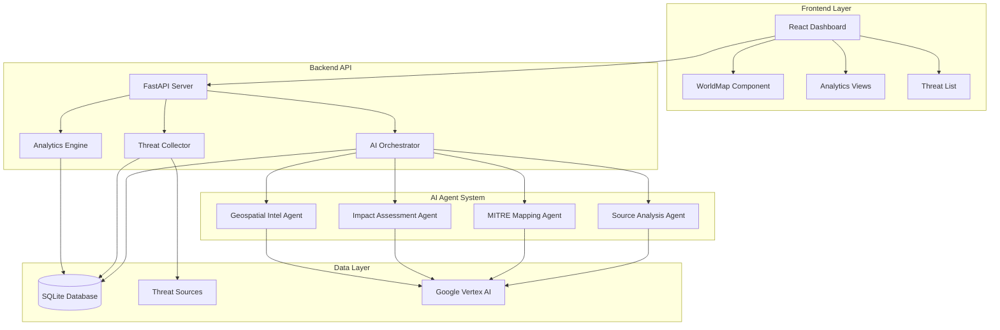
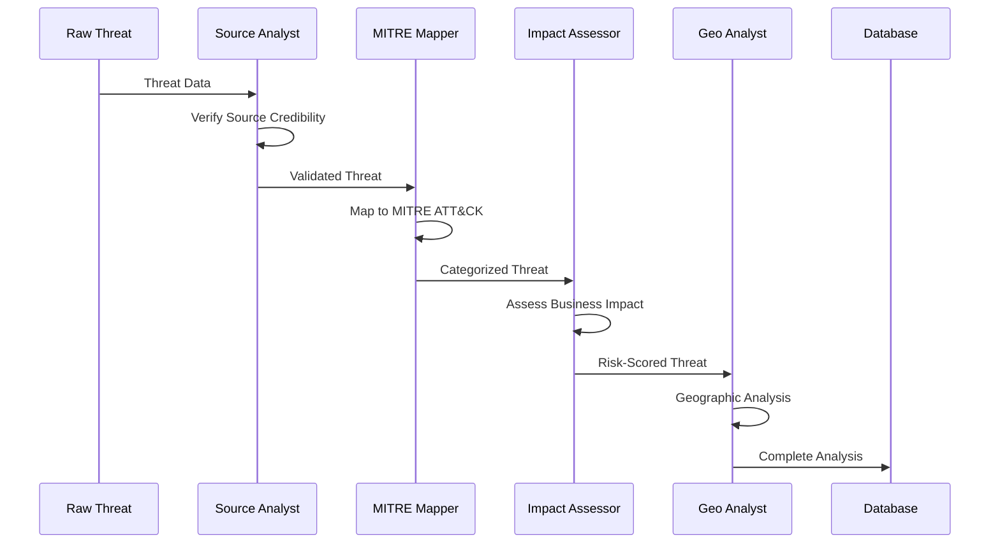

# 🛡️ Cyber Threat Intelligence Dashboard

<div align="center">


*A comprehensive threat intelligence platform powered by multi-agent AI analysis*

</div>

---

## 📋 Table of Contents

- [🚀 Overview](#-overview)
- [✨ Key Features](#-key-features)
- [🏗️ Architecture](#️-architecture)
- [🛠️ Tech Stack](#️-tech-stack)
- [📦 Installation](#-installation)
- [🔧 Configuration](#-configuration)
- [🚀 Usage](#-usage)
- [🤖 AI Agent System](#-ai-agent-system)
- [📊 Dashboard Features](#-dashboard-features)
- [🗺️ World Map](#️-world-map)
- [📈 Analytics](#-analytics)
- [🔌 API Reference](#-api-reference)
- [🧪 Testing](#-testing)
- [📂 Project Structure](#-project-structure)
- [🤝 Contributing](#-contributing)
- [📝 License](#-license)

---

## 🚀 Overview

The **Cyber Threat Intelligence Dashboard** is an advanced platform that automatically collects, analyzes, and visualizes cybersecurity threats using a sophisticated multi-agent AI system. Built specifically for logistics and supply chain organizations, it provides real-time threat intelligence with geospatial analysis and comprehensive risk assessment.

### 🎯 Why This Platform?

- **🤖 AI-Powered Analysis**: Multi-agent system with specialized roles
- **🌍 Global Threat Mapping**: Real-time geospatial threat visualization
- **📊 Advanced Analytics**: Comprehensive threat trends and patterns
- **⚡ Real-time Intelligence**: Automated threat collection and processing
- **🎨 Modern Interface**: Intuitive dashboard with dark theme

---

## ✨ Key Features

<div align="center">

| Feature | Description |
|---------|-------------|
| 🔍 **Threat Collection** | Automated gathering from 15+ sources |
| 🧠 **AI Analysis** | Multi-agent MITRE ATT&CK mapping |
| 🗺️ **World Map** | Interactive global threat visualization |
| 📈 **Analytics** | Trends, patterns, and risk scoring |
| ⚠️ **Risk Assessment** | Business impact and financial analysis |
| 🌐 **Geospatial Intel** | Geographic threat origin tracking |
| 📱 **Responsive Design** | Mobile-friendly interface |
| 🔄 **Real-time Updates** | Live threat feed processing |

</div>

---

## 🏗️ Architecture



---

## 🛠️ Tech Stack

### **Frontend**
- **React 18.3.1** - Modern UI framework
- **Tailwind CSS** - Utility-first styling
- **Lucide React** - Beautiful icons
- **Axios** - HTTP client

### **Backend**
- **FastAPI** - High-performance Python API
- **SQLite** - Lightweight database
- **LangGraph** - AI agent orchestration
- **Google Vertex AI** - LLM processing

### **AI & Analytics**
- **Gemini 2.0 Flash** - Advanced language model
- **MITRE ATT&CK** - Cybersecurity framework
- **Geospatial Intelligence** - Location-based analysis

---

## 📦 Installation

### Prerequisites
- Node.js 16+ and npm
- Python 3.8+
- Google Cloud account with Vertex AI enabled

### 1. Clone the Repository
```bash
git clone https://github.com/your-org/cyber_threat_intel_dashboard.git
cd cyber_threat_intel_dashboard
```

### 2. Backend Setup
```bash
# Navigate to backend
cd backend

# Install Python dependencies
pip install -r requirements.txt

# Set up Google Cloud credentials
export GOOGLE_APPLICATION_CREDENTIALS="path/to/your/service-account.json"
export GOOGLE_CLOUD_PROJECT="your-project-id"
```

### 3. Frontend Setup
```bash
# Navigate to frontend
cd ../frontend

# Install Node dependencies
npm install

# Create environment file
cp .env.example .env.local
```

### 4. Initialize Database
```bash
# From backend directory
python -c "
from threat_collector import ThreatCollector
from threat_agent_orchestrator import ThreatAgentOrchestrator

# Initialize database tables
collector = ThreatCollector()
orchestrator = ThreatAgentOrchestrator()
print('Database initialized successfully!')
"
```

---

## 🔧 Configuration

### Environment Variables

**Backend (.env)**:
```bash
GOOGLE_CLOUD_PROJECT=your-project-id
GOOGLE_CLOUD_REGION=us-central1
DATABASE_PATH=../data/threats.db
LOG_LEVEL=INFO
```

**Frontend (.env.local)**:
```bash
REACT_APP_API_BASE_URL=http://localhost:8000
REACT_APP_REFRESH_INTERVAL=30000
```

### Google Cloud Setup
1. Enable Vertex AI API
2. Create service account with Vertex AI permissions
3. Download service account key
4. Set `GOOGLE_APPLICATION_CREDENTIALS` environment variable

---

## 🚀 Usage

### Start the Backend Server
```bash
cd backend
uvicorn main:app --reload --host 0.0.0.0 --port 8000
```

### Start the Frontend Development Server
```bash
cd frontend
npm start
```

### Access the Dashboard
Open your browser and navigate to: **http://localhost:3000**

### Initial Data Collection
```bash
# Trigger initial threat collection
curl -X POST "http://localhost:8000/api/collect" \
  -H "Content-Type: application/json" \
  -d '{"mode": "hybrid", "max_sources": 8}'
```

---

## 🤖 AI Agent System

The platform uses a sophisticated multi-agent system for comprehensive threat analysis:

### Agent Workflow


### 🔍 **Source Analysis Agent**
- Evaluates source credibility and reputation
- Assigns trust scores (0-100)
- Identifies false positive risks
- Validates editorial standards

### 🎯 **MITRE Mapping Agent**
- Maps threats to MITRE ATT&CK framework
- Identifies tactics, techniques, and procedures
- Assigns sophistication levels
- Provides detection recommendations

### ⚡ **Impact Assessment Agent**
- Calculates business impact scores
- Estimates financial consequences
- Assesses operational disruption
- Recommends response priorities

### 🌍 **Geospatial Intelligence Agent**
- Analyzes geographic threat patterns
- Identifies origin countries and target regions
- Maps infrastructure locations
- Assesses supply chain risks

---

## 📊 Dashboard Features

### 🏠 **Overview Dashboard**
- Real-time threat statistics
- Risk level distribution
- Recent threat activity
- Collection health status

### 🔍 **Threat Analysis**
- Detailed threat listings
- AI-powered categorization
- MITRE ATT&CK mappings
- Source credibility scoring

### 🗺️ **Interactive World Map**
- Global threat visualization
- Country-based risk levels
- Real-time threat markers
- Geographic pattern analysis

### 📈 **Advanced Analytics**
- Threat trend analysis
- Industry targeting patterns
- Actor attribution data
- Predictive risk modeling

---

## 🗺️ World Map

The interactive world map provides comprehensive geospatial threat intelligence:

### Features
- **🎯 Country Risk Levels**: Color-coded threat intensity
- **📍 Threat Markers**: Real-time threat locations
- **🔄 Interactive Tooltips**: Detailed country information
- **🌡️ Heat Map Visualization**: Threat density mapping

### Risk Level Color Coding
- 🔴 **Critical** (80-100): Immediate attention required
- 🟠 **High** (60-79): Significant threat activity
- 🟡 **Medium** (40-59): Moderate risk level
- 🟢 **Low** (0-39): Minimal threat activity

---

## 📈 Analytics

### Threat Trends
```javascript
// Example API call for trend analysis
fetch('/api/analytics/trends?days=30')
  .then(response => response.json())
  .then(data => {
    console.log('Threat trends:', data.trends);
    console.log('Risk progression:', data.risk_progression);
  });
```

### Available Analytics
- **📊 Threat Volume Trends**: Daily/weekly threat counts
- **🎯 Industry Targeting**: Sector-specific analysis
- **🌍 Geographic Distribution**: Regional threat patterns
- **⚠️ Risk Scoring**: Automated risk assessment
- **🔍 Actor Attribution**: Threat actor tracking

---

## 🔌 API Reference

### Core Endpoints

#### 🔍 **Threat Collection**
```http
POST /api/collect
Content-Type: application/json

{
  "mode": "hybrid",
  "max_sources": 8
}
```

#### 📊 **Dashboard Overview**
```http
GET /api/dashboard?hours=24
```

#### 🗺️ **Geospatial Data**
```http
GET /api/analytics/geospatial?days=30&min_confidence=0.5
```

#### 🤖 **AI Analysis**
```http
POST /api/threats/{threat_id}/analyze
Content-Type: application/json

{
  "force_reanalysis": false
}
```

### Response Format
```json
{
  "status": "success",
  "data": {
    "threat_count": 156,
    "risk_distribution": {
      "critical": 12,
      "high": 34,
      "medium": 67,
      "low": 43
    },
    "geographic_data": [...],
    "trends": [...]
  },
  "metadata": {
    "generated_at": "2024-01-15T10:30:00Z",
    "processing_time": 1.23
  }
}
```


### API Testing
```bash
# Health check
curl http://localhost:8000/api/health

# Test threat collection
curl -X POST http://localhost:8000/api/collect \
  -H "Content-Type: application/json" \
  -d '{"mode": "test", "max_sources": 3}'
```

---

## 📂 Project Structure

## 📂 Project Structure

```
cyver_threat_intel_dashboard/
├── 📁 frontend/                  # React frontend application
│   ├── 📁 public/               # Static assets
│   ├── 📁 src/
│   │   ├── 📁 components/       # React components
│   │   │   ├── Dashboard.js     # Main dashboard
│   │   │   ├── WorldMap.js      # Interactive map
│   │   │   ├── ThreatList.js    # Threat listings
│   │   │   └── Analytics.js     # Analytics views
│   │   ├── 📁 services/         # API services
│   │   │   └── api.js           # API client
│   │   └── App.js               # Root component
│   ├── package.json             # Frontend dependencies
│   └── tailwind.config.js       # Styling configuration
├── 📁 backend/                   # Python backend API
│   ├── main.py                  # FastAPI application
│   ├── threat_collector.py      # Threat collection engine
│   ├── threat_agent_orchestrator.py  # AI agent system
│   ├── ai_analyzer.py           # AI analysis utilities
│   |
│   └── requirements.txt         # Python dependencies
├── 📁 data/                     # Database and data files
│  
├── .gitignore                   # Git ignore rules               # Environment template
└── README.md                   # Project documentation
```

---

## 🚀 Quick Start Guide

### 1. **First Time Setup** (5 minutes)
```bash
# Clone and setup
git clone <repository-url>
cd cyver_threat_intel_dashboard

# Backend setup
cd backend && pip install -r requirements.txt

# Frontend setup  
cd ../frontend && npm install

# Set environment variables
export GOOGLE_APPLICATION_CREDENTIALS="path/to/service-account.json"
export GOOGLE_CLOUD_PROJECT="your-project-id"
```

### 2. **Start Services** (30 seconds)
```bash
# Terminal 1: Start backend
cd backend && uvicorn main:app --reload

# Terminal 2: Start frontend
cd frontend && npm start
```

### 3. **Collect Initial Data** (2 minutes)
```bash
# Trigger threat collection
curl -X POST http://localhost:8000/api/collect
```

### 4. **Access Dashboard**
Open: **http://localhost:3000** 🎉

---

## 🔧 Advanced Configuration

### Database Optimization
```python
# backend/config.py
DATABASE_CONFIG = {
    "pool_size": 20,
    "max_overflow": 30,
    "pool_timeout": 30,
    "pool_recycle": 3600
}
```

### AI Agent Tuning
```python
# Adjust agent confidence thresholds
AGENT_CONFIG = {
    "source_analysis": {
        "min_credibility_score": 70,
        "trust_threshold": 0.8
    },
    "mitre_mapping": {
        "confidence_threshold": 0.7,
        "technique_validation": True
    },
    "impact_assessment": {
        "risk_multiplier": 1.2,
        "financial_threshold": 100000
    }
}
```

### Custom Threat Sources
```python
# Add new threat intelligence sources
CUSTOM_SOURCES = [
    {
        "name": "custom_feed",
        "url": "https://your-threat-feed.com/api",
        "headers": {"Authorization": "Bearer YOUR_TOKEN"},
        "parser": "json",
        "confidence": 0.8
    }
]
```

---

## 📊 Performance Metrics

### System Performance
- **⚡ Threat Processing**: ~2-5 seconds per threat
- **🧠 AI Analysis**: ~10-15 seconds per agent
- **🗺️ Map Rendering**: <500ms with 1000+ markers
- **📊 Analytics**: <2 seconds for 30-day trends

### Scalability
- **📈 Concurrent Users**: 50+ simultaneous users
- **💾 Database**: 100K+ threats with sub-second queries
- **🔄 Real-time Updates**: 1000+ threats/hour processing
- **🌍 Geographic Data**: Global coverage with city-level precision

---

## 🛡️ Security Features

### Data Protection
- **🔐 API Authentication**: Token-based security
- **🔒 Data Encryption**: At-rest and in-transit
- **🛡️ Input Validation**: Comprehensive sanitization
- **📝 Audit Logging**: Complete activity tracking

### Privacy Compliance
- **🇪🇺 GDPR Ready**: Data minimization and retention
- **🔒 PII Protection**: Automated data anonymization
- **📋 Compliance Reports**: Automated compliance checking

---


## 🤝 Contributing

### Development Workflow
```bash
# 1. Fork the repository
# 2. Create feature branch
git checkout -b feature/amazing-feature

# 3. Make changes and test
npm test                    # Frontend tests
python -m pytest          # Backend tests

# 4. Commit changes
git commit -m "Add amazing feature"

# 5. Push and create PR
git push origin feature/amazing-feature
```

### Code Standards
- **Frontend**: ESLint + Prettier
- **Backend**: Black + isort + mypy
- **Documentation**: Markdown with diagrams
- **Testing**: >80% code coverage required

### 🐛 **Bug Reports**
Use the issue template with:
- Environment details
- Steps to reproduce
- Expected vs actual behavior
- Screenshots/logs

---

## 📚 Additional Resources

### 📖 **Documentation**
- [API Reference](docs/API.md)
- [Agent Architecture](docs/AGENTS.md)
- [Deployment Guide](docs/DEPLOYMENT.md)
- [Troubleshooting](docs/TROUBLESHOOTING.md)

### 🎓 **Learning Resources**
- [MITRE ATT&CK Framework](https://attack.mitre.org/)
- [Threat Intelligence Basics](https://www.sans.org/threat-intelligence/)
- [LangGraph Documentation](https://langchain-ai.github.io/langgraph/)

### 🌟 **Community**
- [Discord Server](https://discord.gg/threat-intel)
- [GitHub Discussions](https://github.com/your-org/discussions)
- [Weekly Office Hours](https://calendly.com/threat-intel-office-hours)

---

## 📝 License

This project is licensed under the **MIT License** - see the [LICENSE](LICENSE) file for details.

---

## 🙏 Acknowledgments

### Special Thanks
- **🤖 Google Vertex AI** - Powering our AI agents
- **🎯 MITRE Corporation** - ATT&CK framework
- **🌍 Threat Intelligence Community** - Open source feeds
- **⚛️ React & FastAPI Teams** - Excellent frameworks


**⭐ Star this repository if it helped secure your organization! ⭐**

Made with 💙 for the cybersecurity community

</div>
